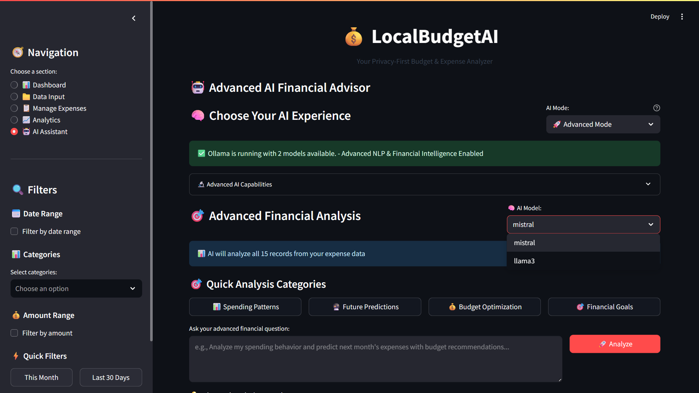
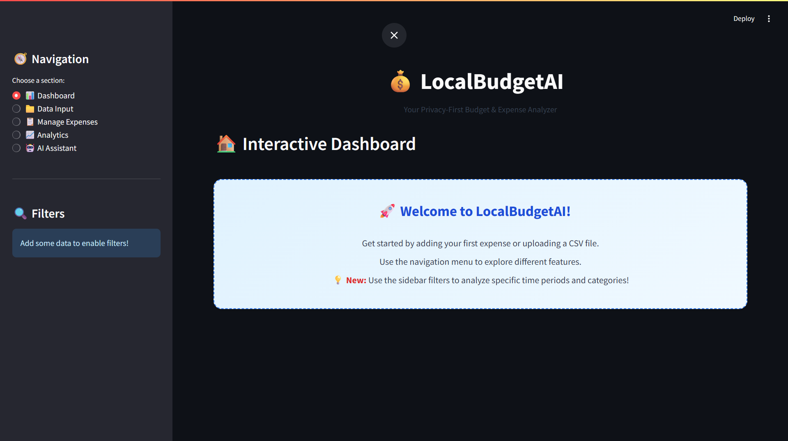
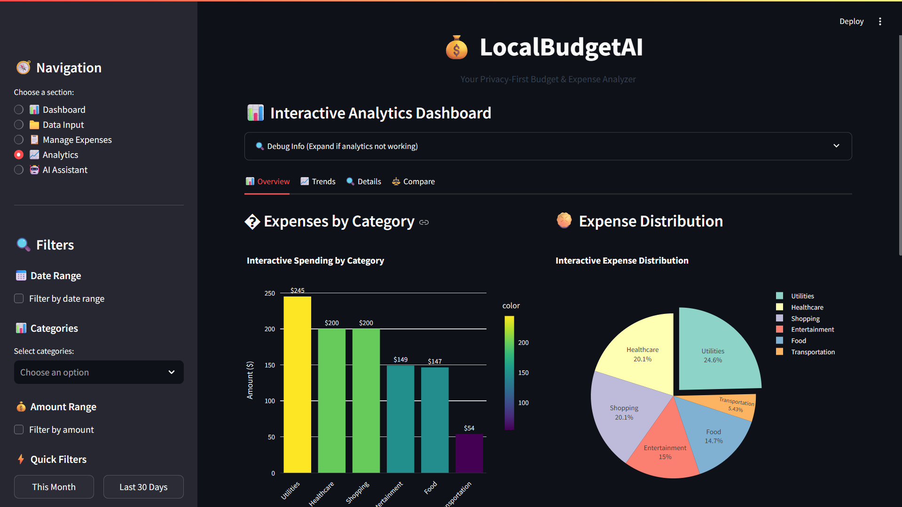

# 💰 LocalBudgetAI 

<div align="center">

**A modern, local-first personal finance dashboard with privacy at its core.**

<br>

<p align="center">
  
</p>

[](https://python.org)
[](https://streamlit.io)
[](https://opensource.org/licenses/MIT)

[](https://ollama.ai)
[](#-how-the-ai-works)

</div>

---

## 📚 Table of Contents

- [✨ Key Features](#-key-features)
- [📸 Screenshots](#-screenshots)
- [🎥 Demo Video](#-demo-video)
- [🚀 Getting Started](#-getting-started)
- [🧠 How the AI Works](#-how-the-ai-works)
- [🛠️ Tech Stack](#️-tech-stack)
- [🛡️ Privacy & Security](#️-privacy--security)
- [📂 Folder Structure](#-folder-structure)
- [🤝 Contributing](#-contributing)
- [📄 License](#-license)
- [🙏 Acknowledgements](#-acknowledgements)

---

## ✨ Key Features

- **📊 Interactive Dashboards**: Create stunning, interactive financial dashboards with Plotly. Hover for details, zoom into trends, and export charts with a single click.
- **🗓️ Financial Analytics**: Get a clear view of your finances with monthly and category-wise breakdowns of income, expenses, and savings.
- **🤖 Natural Language AI Assistant**: Chat with your data using a powerful, dual-LLM AI assistant powered by Ollama (Mistral & Llama3). Ask complex questions and get instant insights.
- **💸 Budget Optimization**: Receive AI-driven advice on optimizing your budget, setting financial goals, and understanding your spending behavior.
- **🔒 Works Fully Offline**: Your data is stored locally in a SQLite database. The app works perfectly without an internet connection.
- **🔐 100% Data Privacy**: No cloud servers, no data leaks. All processing happens on your machine, ensuring your financial information remains completely private.

---

## 📸 Screenshots

<p align="center">
  
  &nbsp;
  
</p>

---

## 🎥 Demo Video

Check out the demo video to see LocalBudgetAI in action!

*Note: The demo video is located at `DEMO/DEMO-VID(V1).mp4`*

---

## 🚀 Getting Started

### Prerequisites
- Python 3.8+
- `pip` (Python package manager)
- An IDE (e.g., VS Code)

### 1. Clone the Repository

```bash
git clone https://www.github.com/MananVyas01/LocalBudgetAI.git
cd LocalBudgetAI
```

### 2. Set Up a Virtual Environment
Create and activate a virtual environment to keep dependencies isolated.

```bash
# For macOS/Linux
python3 -m venv venv
source venv/bin/activate

# For Windows
python -m venv venv
.\venv\Scripts\activate
```

### 3. Install Dependencies
Install all required packages from the `requirements.txt` file.

```bash
pip install -r requirements.txt
```

### 4. Run the App
Launch the Streamlit application.

```bash
streamlit run app/main.py
```

### 5. Set Up Local AI Features
To enable the AI assistant, you need to install Ollama and pull the required models.

1.  **Install Ollama**: Follow the official instructions at [ollama.ai](https://ollama.ai).
2.  **Pull Models**: Open your terminal and run the following commands:
    ```bash
    ollama pull mistral
    ollama pull llama3
    ```

---

## 🧠 How the AI Works

LocalBudgetAI uses a sophisticated dual-LLM system via Ollama to provide intelligent financial insights.

- **🤖 Dual LLMs**: The app leverages both **Mistral** and **Llama3** models. If one model fails or provides a poor response, the system automatically retries with the other, ensuring reliability.
- **🎯 Intent Recognition**: The AI is trained to understand financial queries, recognize user intent, and provide context-aware answers based on your data.
- **📈 Predictive Analytics**: The AI can analyze historical data to forecast spending trends and help you plan for future financial goals.

---

## 🛠️ Tech Stack

- **Backend**: Python
- **Frontend**: Streamlit
- **Database**: SQLite
- **Data Manipulation**: Pandas, NumPy
- **Visualizations**: Plotly
- **AI/NLP**: Ollama, NLTK, TextBlob
- **Machine Learning**: Scikit-learn

---

## 🛡️ Privacy & Security

- **🔒 100% Local Data**: Your financial data is stored in a local SQLite database and is never sent to the cloud.
- **✈️ Offline Mode**: The app is fully functional without an internet connection.
- **🚫 No Third-Party Sharing**: We respect your privacy. Your data is never shared with any third parties.

---

## 📂 Folder Structure

```
LocalBudgetAI/
│
├── app/
│   ├── main.py             # Main Streamlit application
│   ├── database.py         # Database connection and queries
│   ├── analyzer.py         # Core data analysis functions
│   ├── plotly_analyzer.py  # Plotly visualization functions
│   ├── llm_helper.py       # Helper for basic AI functionalities
│   └── advanced_llm_helper.py # Helper for advanced AI features
│
├── data/
│   ├── expenses.db         # SQLite database
│   └── README.md
│
├── DEMO/
│   ├── AI-Assistant.png
│   ├── Analytics.png
│   ├── Main-Dashboard.png
│   └── DEMO-VID(V1).mp4
│
├── requirements.txt        # Project dependencies
└── README.md               # This file
```

---

## 🤝 Contributing

Contributions are welcome! Please feel free to submit a pull request or open an issue to discuss your ideas.

---

## 📄 License

This project is licensed under the MIT License. See the [LICENSE](https://opensource.org/licenses/MIT) file for details.

---

## 🙏 Acknowledgements

- [Streamlit](https://streamlit.io/) for the amazing web framework.
- [Ollama](https://ollama.ai/) for making local AI accessible.
- [Plotly](https://plotly.com/) for the beautiful and interactive charts.
